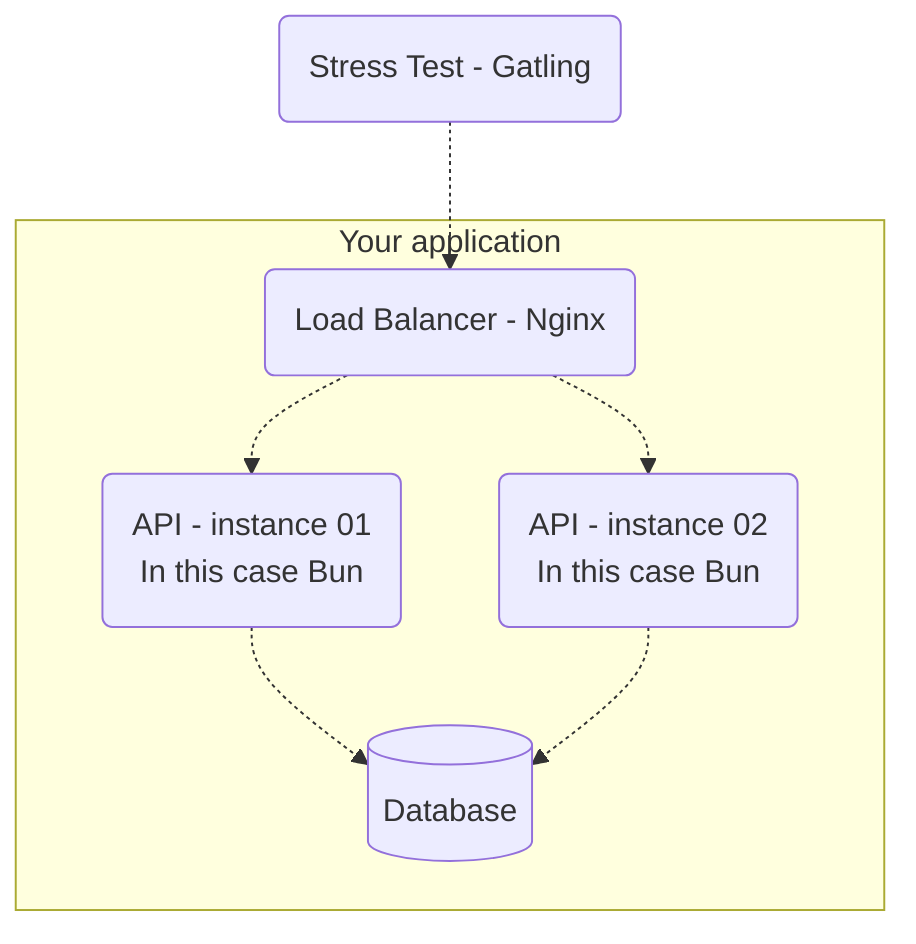

# Rinha 2023
This code is based on a challenge that was proposed [here](https://github.com/zanfranceschi/rinha-de-backend-2023-q3/tree/main) (pt-br).
But Basically it is a HTTP API for person, and the challenge was to see how many requests and inserts the API could handle on a Stress testing. Still optimizing the performance, but wanted to make my own version using Bun (even though the challenge is long finished), based on this [JS project](https://github.com/lukas8219/rinha-be-2023-q3).

Running the stress testing from the first link, but the workflow of it with the implemented here is as follows:



#### To run:
```bash
make
```
